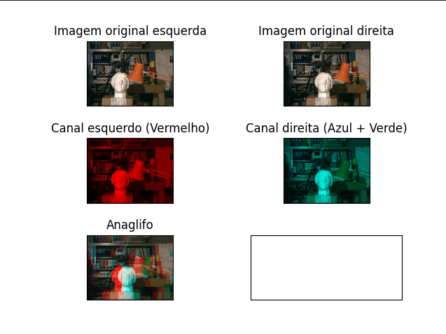

# Reversão Anaglífica através de Block Matching (WIP)

Este repositório contém o código e material desenvolvido no projeto de iniciação 
científica entitulado "Reversão Anaglífica utilizadno Block Matching", desenvolvido 
por Felipe Carneiro Machado, estudante do Bacharelado em Ciências da Computação, 
no ICMC, Instituto de Ciências Matemáticas e de Computação, da USP, campus de
São Carlos, sob orientação de Rudinei Goularte, Professor Associado no ICMC, 
departamento de ciências da computação.

A reversão é o processo de recuperar um par estereo a partir de um anáglifo. Neste 
projeto, foi estudado o uso do algoritmo de Block Matching para este fim. Caso não 
esteja familizarizado com estes termos, prossiga para a seção de fundamentos teóricos,
caso contrário, a seção "Executando o código" contém as instruções para uso.


## Índice

- [Executando o código](#executando-o-código)

- [Fundamentos teóricos](#fundamentos-teóricos)

## Executando o código

O projeto foi desenvolvido inteiramente em linguagem python, na versão 3.12. 
Assim, é necessário que o interpretador python esteja instalado em versão compatível.

É possível utilizar o código apenas com o pacote "arbfls", presente no repositório. 
Podendo ser baixado clonando o repositório com:

```sh
git clone https://github.com/FelipeCarneiroMachado/Reversao-Anaglifica-por-Block-Matching.git
```

Também será necessário instalar as depedências do projeto, utlizando o pip dentro de
um venv python:

```shell
python3 -m venv .
source $(pwd)/bin/activate
pip install -r requirements.txt
```


## Fundamentos teóricos

Nesta seção será apresentado o algoritmo desenvolvido, bem como as bases da teoria
sobre o qual ele foi construído. Para mais detalhes, consulte os trabalhos também 
presentes nesse repositório.

### 1. Estereoscopia e anáglifos

Imagens estereoscópicas, popularmente conhecidas como imagens "3-D", são imagens
capturadas a partir de duas câmeras posicionadas a uma pequena distância uma da outra,
de modo a simular a aquisição de imagens pela vista humana. A estereoscopia é a área
responsável por desenvolver métodos para aquisição e visualização destas imagens, de modo
a transmitir a impressão de profundidade ao espectador, fenômeno nomeado estereopsia.

No tópico da visualização, foram desenvolvidos uma gama de métodos, entre eles 
a multiplexação por cor, por tempo, por polarização de luz e os *Head Mounted Displays*.
Neste projeto, voltou-se a atenção para a multiplexação por cor. Esta baseia-se em 
criar uma única imagem, o anáglifo, que contém informação de ambas as imagens do par 
estereo, embutidas em canais de cores diferentes. Dessa maneira, é possível visualizar 
o conteúdo a partir de óculos com lentes coloridas, de modo que cada olho receba apenas 
as cores que lhe são destinadas. Outros métodos de visualization estereoscópica são 
apresentados em mais detalhes nos trabalhos disponíveis neste repositório. 

O processo de codificação anaglífica consiste em extrair 1 canal de cor de uma imagem
do par estereo, e os dois canais restantes da outra imagem, assumindo o padrão RGB de
codificação de cor. Vale notar que este processo descarta 50% da informação do par estereo.
Segue abaixo uma representação visual do processo.



A visualização anaglífica é possível pela fusão das imagens pelo cérebro humano,
já que grande parte da informação descartada de cada peça do par estereo está
presente na outra metade. Ainda assim, esta técnica apresenta a menor qualidade visual,
marcada por artefatos e *ghosting*, sendo substituída atualmente por tecnologias mais
modernas. 

Em contrapartida, a codificação anaglífica é rápida, não precisa de projetores ou 
especiais, e os óculos para visualização são simples, logo consistindo no método 
mais barato e acessível de visualização. Além disso, representa ainda uma técnica
que, dado que hajam avanços na área de reversão anaglífica, explicada em mais 
detalhes na próxima seção, pode ser usada na compressão de conteúdo estereoscópico, 
diminuindo em até 50% o volume de dados.

### 2. Correspondência e reversão anaglífica

Tendo em vista os objetivos da compressão de dados e recuperação de conteúdo legado,
foi desenvolvida a área da reversão anaglífica, ou seja, o processo de obter um par 
estereo completo a partir de um anáglifo. Ao passo que a codificação anaglífica é 
uma atividade trivial, a reversão é uma tarefa de alta complexidade, dado o descarte 
massivo de informação. 

A ideia básica dos algoritmos de reversão anaglífica é buscar informação sobre os 
canais perdidos de um lado do par estereo nos canais mantidos do outro lado, provindo
do fato que as diferenças entre as duas imagens são pequenas. Em pares estereo 
convencionais, este processo é conhecido como correspondência estereo, para anáglifos,
correspondência anglífica.

A correspondência estereo é marcada por alguns desafios, os mais notáveis são as
diferenças fotométricas e radiométricas, as inconsistências nas capturas entre as imagens, 
e as regiôes de baixa textura, partes das imagens de cores sólidas ou com padrôes 
repetitivos, que dificultam formar certeza sobre a correspodência correta. A correspondência
anaglífica, por sua vez, ainda deve lidar com as diferenças radicais entre as imagens, 
pois a comparação é realizada entre canais de cores diferentes.

