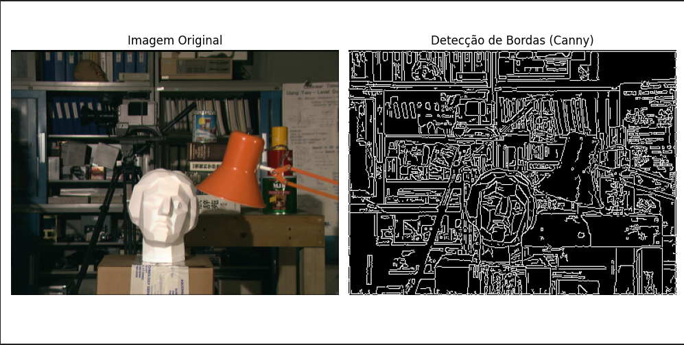

# Reversão Anaglífica através de Block Matching

Este repositório contém o código e material desenvolvido no projeto de iniciação 
científica intitulado "Reversão Anaglífica utilizando Block Matching", desenvolvido 
por Felipe Carneiro Machado, estudante do Bacharelado em Ciências da Computação, 
no ICMC, Instituto de Ciências Matemáticas e de Computação, da USP, campus de
São Carlos, sob orientação de Rudinei Goularte, Professor Associado no ICMC, 
departamento de ciências da computação.

A reversão é o processo de recuperar um par estereo a partir de um anáglifo. Neste 
projeto, foi estudado o uso do algoritmo de Block Matching para este fim. Caso não 
esteja familiarizado com estes termos, prossiga para a seção de fundamentos teóricos,
caso contrário, a seção "Executando o código" contém as instruções para uso.


## Índice

- [Executando o código](#executando-o-código)

- [Fundamentos teóricos](#fundamentos-teóricos)

- [Técnica Desenvolvida](#técnica-desenvolvida)

- [Tópicos Abordados Neste Projeto](#tópicos-abordados-neste-projeto)


## Executando o código

### Download e dependências

O projeto foi desenvolvido inteiramente em linguagem python, na versão 3.12. 
Assim, é necessário que o interpretador python esteja instalado em versão compatível.

É possível utilizar o código apenas com o pacote "arbfls", presente no repositório. 
Podendo ser baixado clonando o repositório com:

```sh
git clone https://github.com/FelipeCarneiroMachado/Reversao-Anaglifica-por-Block-Matching.git
```

Também será necessário instalar as dependências do projeto, utilizando o pip num
venv python:

```shell
python3 -m venv .
source $(pwd)/bin/activate
pip install -r requirements.txt
```

Resolvida a instalação, está disponível no diretório raiz o arquivo `demo.py`, com uma 
demonstração num anáglifo gerado a partir das 2 imagens no diretório `demo_images`.


### Sobre o pacote

O pacote possui a função `arbfls.anagl_reverse.reverse` como ponto de entrada. Esta é
a função de reversão anaglífica em si. 

```python
def reverse(anaglyph : np.ndarray, config : dict = config_dict) -> tuple[np.ndarray, np.ndarray]:
```

No arquivo `arbfls.config` está o dicionário de configuração do pacote, estando definidos 
os parâmetros padrão. Para alterá-los, é possível alterar diretamente o arquivo, ou passar
uma cópia alterada do dicionário para a função `reverse` e outras funções que tenham esse
parâmetro.

Além da função `reverse`, o pacote possui no arquivo `utils.py` a função `gen_anaglyph`,
para gerar um anáglifo a partir de um par estereo, e a função `calculate_psnr` que computa
o PSNR (*Peak Signal to Noise Ratio*), métrica objetiva para a qualidade da reconstrução da imagem.

As demais funções presentes no pacote são de uso interno, podendo e devendo ser consultadas
para possibilidades de configuração.


Por ser um código desenvolvido com o fim de pesquisa e divulgação científica, está munido
com um modo interativo, que pode ser ativado com a chave "interactive" do dicionário 
de configuração, atribuindo-a o valor `True`. Neste modo, cada passo do algoritmo será 
mostrado visualmente, mostrando o bloco em questão, a janela de busca e a correspondência
realizada, teclar sobre a janela procede para a próxima iteração.


## Fundamentos teóricos

Nesta seção será apresentado o algoritmo desenvolvido, bem como as bases da teoria
sobre o qual ele foi construído. Para mais detalhes, consulte os trabalhos também 
presentes nesse repositório.

### 1. Estereoscopia e anáglifos

Imagens estereoscópicas, popularmente conhecidas como imagens "3-D", são imagens
capturadas a partir de duas câmeras posicionadas a uma pequena distância uma da outra,
de modo a simular a aquisição de imagens pela vista humana. A estereoscopia é a área
responsável por desenvolver métodos para aquisição e visualização destas imagens, de modo
a transmitir a impressão de profundidade ao espectador, fenômeno nomeado estereopsia.

No tópico da visualização, foram desenvolvidos uma gama de métodos, entre eles 
a multiplexação por cor, por tempo, por polarização de luz e os *Head Mounted Displays*.
Neste projeto, voltou-se a atenção para a multiplexação por cor. Esta baseia-se em 
criar uma única imagem, o anáglifo, que contém informação de ambas as imagens do par 
estereo, embutidas em canais de cores diferentes. Dessa maneira, é possível visualizar 
o conteúdo a partir de óculos com lentes coloridas, de modo que cada olho receba apenas 
as cores que lhe são destinadas. Outros métodos de visualization estereoscópica são 
apresentados em mais detalhes nos trabalhos disponíveis neste repositório. 

O processo de codificação anaglífica consiste em extrair 1 canal de cor de uma imagem
do par estereo, e os dois canais restantes da outra imagem, assumindo o padrão RGB de
codificação de cor. Vale notar que este processo descarta 50% da informação do par estereo.
Segue abaixo uma representação visual do processo.


<figure>
    
    <figcaption style="text-align: center;">Fonte: Autoral</figcaption>
</figure>

A visualização anaglífica é possível pela fusão das imagens pelo cérebro humano,
já que grande parte da informação descartada de cada peça do par estereo está
presente na outra metade. Ainda assim, esta técnica apresenta a menor qualidade visual,
marcada por artefatos e *ghosting*, sendo substituída atualmente por tecnologias mais
modernas. 

Em contrapartida, a codificação anaglífica é rápida, não precisa de projetores ou 
especiais, e os óculos para visualização são simples, logo consistindo no método 
mais barato e acessível de visualização. Além disso, representa ainda uma técnica
que, dado que hajam avanços na área de reversão anaglífica, explicada em mais 
detalhes na próxima seção, pode ser usada na compressão de conteúdo estereoscópico, 
diminuindo em até 50% o volume de dados.

### 2. Correspondência e reversão anaglífica

Tendo em vista os objetivos da compressão de dados e recuperação de conteúdo legado,
foi desenvolvida a área da reversão anaglífica, ou seja, o processo de obter um par 
estereo completo a partir de um anáglifo. Ao passo que a codificação anaglífica é 
uma atividade trivial, a reversão é uma tarefa de alta complexidade, dado o descarte 
massivo de informação. 

A ideia básica dos algoritmos de reversão anaglífica é buscar informação sobre os 
canais perdidos de um lado do par estereo nos canais mantidos do outro lado, provindo
do fato que as diferenças entre as duas imagens são pequenas. Em pares estereo 
convencionais, este processo é conhecido como correspondência estereo, para anáglifos,
correspondência anglífica.

A correspondência estereo é marcada por alguns desafios, os mais notáveis são as
diferenças fotométricas e radiométricas, as inconsistências nas capturas entre as imagens, 
e as regiôes de baixa textura, partes das imagens de cores sólidas ou com padrôes 
repetitivos, que dificultam formar certeza sobre a correspodência correta. A correspondência
anaglífica, por sua vez, ainda deve lidar com as diferenças radicais entre as imagens, 
pois a comparação é realizada entre canais de cores diferentes.

### 3. Block Matching

O *Block Matching* é um algoritmo de correspondência, muito utilizado para 
estimação de movimento em vídeo, que forma a base da técnica discutida neste projeto.
Baseia-se em busca local por correspondência, 
tomando um bloco como base e buscando na outra imagem, numa janela de busca
que circunda a original o bloco que minimiza uma métrica de
erro adotada.  

<figure>
    
    <figcaption style="text-align: center;"><a href="https://ijaers.com/uploads/issue_files/46-IJAERS-MAY-2018-43-Motion.pdf">Fonte</a></figcaption>
</figure>

## Técnica desenvolvida

O processo implementado foi baseado na dissertação de mestrado de Juliano Kunze,
disponível neste repositório, buscando implementar melhorias pontuais no desempenho.
Kunze nomeou sua técnica como *ARBFLS* (*Analgyphical Rerversion Based on Fast Local Search*),
ou Reversão Anaglífica Baseada em Busca Local Rápida. Utiliza-se do *Block Matching* atuando
sobre uma representação das bordas das imagens para realizar a busca das correspondências.

A técnica pode ser divida em duas etapas principais: pré-processamento de imagem, onde
são geradas as representações das imagens, e busca de correspondências e transferência 
de cor, aplicando o block matching e reconstruindo o par estereo.


### Pré-processamento

Primeiramente, é necessário separar os canais de cores do anáglifo em esquerda e direita.
A execução desse passo depende apenas do tipo de anáglifo em questão, ou seja, como
foi feito o descarte de cores. Nesta implementação foi dada enfâse aos anáglifos verde-magenta,
nos quais é mantido o canal verde do lado esquerdo e os canais vermelho e azul do lado direito.
Logo, basta separar estes canais no anáglifo, além disso, na imagem esquerda é replicado
em todos os canais o verde extraído do anáglifo, e na direita, o canal verde recebe o azul.

A grande dificuldade da reversão anaglífica é a impossibilidade de comparação direta entre
as visões esquerda e direita, devido à diferença de cores. Para contornar este problema, 
Kunze propõe realizar a correspondência sobre as imagens de bordas. Em sua dissertação,
faz uso do detector de bordas de Canny, baseado na aplicação do operador gradiente sobre 
a imagem.

<figure>
    
    <figcaption style="text-align: center;">Fonte: Autoral</figcaption>
</figure>


### Busca de Correspondência e Transferência de cor

A técnica baseia-se em buscar o bloco correspondente na imagem de bordas, e transferir para
os canais descartados os valores de pixel encontrados neste bloco. 

#### Block Matching em detalhes

O algoritmo particiona as imagens em blocos de tamanho fixo, e, para cada imagem do par,
itera sobre cada um dos blocos buscando o seu correspondente na outra imagem. Em cada busca
por correspondência, itera-se sobre uma janela de busca em torno das coordenadas iniciais 
do bloco aplicando uma função de perda em cada bloco presente nessa janela. A função 
escolhida neste caso é a soma das diferenças absolutas (SAD) definida por:


Onde x e y são as coordenadas na imagem original I, x' e y' as coordenadas na imagem onde está
sendo buscada a correspondência I' e Tb é o tamanho do bloco.

### Avaliação de Resultados

A avaliação da qualidade de uma restauração de imagem é marcada pela subjetividade, não há
método objetivo para avaliar a compreensão humana de uma figura, dessa forma são necessários
testes com voluntários para avaliar a sua percepção, realizados seguindo processos rigorosos.
Detalhes e resultados deste tipo de avaliação estão disponíveis na dissertação de Kunze.

Pode-se estabelecer como métrica objetiva e calculável da qualidade da reconstrução do par
estereo o PSNR (*Peak-Signal to Noise Ratio*),
métrica entre 0 e 100 relativa ao erro quadrático médio entre a imagem original e
sua reconstrução. A seguinte equação é utilizada para seu cálculo:


## Tópicos abordados neste Projeto

Este projeto de Iniciação científica foi iniciado com o objetivo de melhorar os resultados
desta técnica a partir de alterações pontuais no algoritmo. Esta seção cobre as mudanças propostas.

### Substituição da detecção de bordas de Canny

Manteve-se a ideia de representar uma imagem a partir de suas bordas, já que esta é uma
representação independente de cor. Forma testados a aplicação dos filtros: Gradiente de Sobel,
Detecção de Bordas de Marr-Hildreth e Laplaciano.

#### Gradiente de Sobel

Operador diferencial de primeira ordem, computa as derivadas direcionais para cada pixel
da imagem, a Detecção de Bordas de Canny baseia-se neste filtro.
O gradiente terá valores altos em bordas (diferenças bruscas de intensidade) e valor constante
em regiões com mudança gradual de intensidade. Regiões sem textura terão valores baixos.
Utilizou-se uma suavização
da imagem a partir de um filtro gaussiano antes da aplicação do gradiente para minimização do
ruído. 

A aplicação dos filtros gera 2 imagens, com as derivadas nas direções x e y, para obter uma
representação única, testou-se o uso da derivada em x, em y, a norma euclidiana, a aproximação
da norma a partir da soma dos módulos e o ângulo do vetor.


#### Laplaciano

Operador diferencial de segunda ordem, computa a soma das segundas derivadas direcionais
e é a base do Detector de Bordas de Marr-Hildreth. Em comparação ao gradiente, é mais sensível
às bordas, porém também afetado em maior proporção pelo ruído. Não resulta em valores altos
em regiões com variação gradual de intensidade.

Um detalhe do Laplaciano, é que ao se deparar com uma linha/borda, ele deixa dois picos
de intensidade, um positivo e outro negativo, correspondendo às laterais da borda, e não 
à borda em si, fato utilizado pelo detector de Marr-Hildreth, a ser detalhado em seguida.

Da mesma forma que todas as outras técnicas, aplicou-se suavização gaussiana para minimizar 
ruído. Foram testadas duas formas de pré-processamento com o Laplaciano, seu valor integral
e seu valor absoluto. 


#### Detecção de bordas de Marr-Hildereth

Consiste na aplicação do Laplaciano na imagem, após suavizamento gaussiano, e buscar
os pontos onde há cruzamento por zero, ou seja, os pixels onde o valor é negativo de um lado
e positivo do outro. Como explicado na seção do Laplaciano, estes são considerados como 
as bordas na saĩda do algoritmo.

#### Resultados

| Pré Processamento | Média PSNR Esquerdo | Média PSNR Direito |
|:------------------|:--------------------|:-------------------|
| Sobel\_x          | 22.2825             | 26.03              |
| LoG               | 23.58               | 25.9325            |
| Abs\_laplacian    | 23.045              | 25.7525            |
| Sobel\_l1         | 22.195              | 25.24              |
| Sobel\_ang        | 22.08               | 24.98              |
| Sobel\_y          | 22.085              | 24.525             |
| Sobel\_l2         | 20.40               | 23.18              |
| Canny             | 20.755              | 22.98              |


